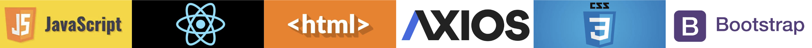
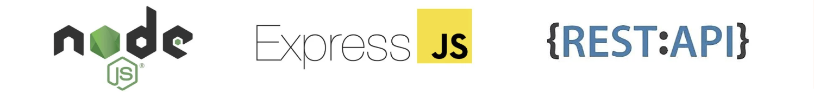
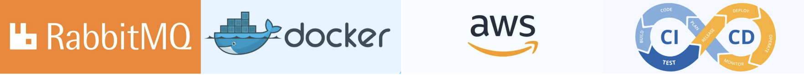
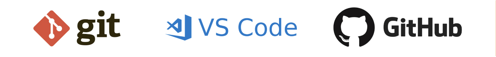
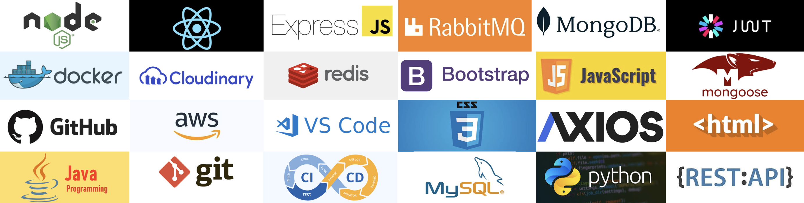

  

 

  
  
  
  
  
  
  
  
  
  
  
  
  
  
  

## Full-Stack Developer | MERN | Backend Engineering | Problem Solver  
I'm a Full-Stack Engineer focused on Backend Architecture, APIs, Scalability and Distributed Systems

- Specializing in the MERN stack (MongoDB, Express, React, Node.js)
- Currently deepening my expertise in backend architecture, APIs, and performance optimization
- Actively building projects, including a full-stack hospital management system 
- Passionate about writing clean, maintainable, and scalable code
- Continuously learning new technologies and best practices

I’m open to collaborating on real-world MERN projects and open-source contributions.
Currently exploring scalable API design and production-grade deployment strategies.

## Featured Projects

### ReadyBuy — Enterprise MERN E-Commerce Platform

A production-oriented full-stack e-commerce platform with a modular backend, role-based access control, caching, asynchronous messaging, and scalable media management.
One of the primary goals of ReadyBuy is to demonstrate enterprise software architecture rather than just implementing CRUD operations.

**Tech Stack:** `React.js` `Node.js` `Express.js` `MongoDB` `Redis` `RabbitMQ` `JWT` `Docker` `Cloudinary` `React Query` `Bootstrap`

**[Live Demo](https://readybuy-six.vercel.app) · [Source Code](https://github.com/Anurag-3112/ReadyBuy-E-commerce)**

---

### Medicare — MERN Patient Management System

A full-stack patient management and appointment scheduling platform designed to streamline doctor-patient workflows, authentication, scheduling, and medical record management.

**Tech Stack:** `React.js` `Node.js` `Express.js` `MongoDB Atlas` `Mongoose` `JWT` `Google OAuth` `REST APIs`

**[Live Demo](https://medicare-seven-phi.vercel.app/) · [Source Code](https://github.com/Anurag-3112/MediCare)**

---

  <i>Building practical software, learning through real-world problems, and continuously improving.</i>

## Tech Stack

### Language

  

### Frontend

  

### Backend

  

### Databases & Caching

  

### Messaging & Infrastructure

  

 

### Tools

  

 

<!--            -->

<!-- 

  

 -->

<!-- 

 -->

## Data Structures and Algorithms

<!-- 
 -->

<!-- 
 -->

<table>
<tr>
<td>

</td>
<td>

</td>
</tr>
</table>

## GitHub Stats

  
  

## Contribution Graph

## Let's Connect

- 📧 Email: [kumar.anurag.connect@gmail.com](mailto:kumar.anurag.connect@gmail.com)
- 💼 GitHub: [@Anurag-3112](https://github.com/Anurag-3112)
- 🌐 Portfolio: [anuragkumar-portfolio.vercel.app](https://anuragkumar-portfolio.vercel.app)

>  I believe in building useful projects before perfect ones.

<!--
**Anurag-3112/Anurag-3112** is a ✨ _special_ ✨ repository because its `README.md` (this file) appears on your GitHub profile.

Here are some ideas to get you started:

- 🔭 I’m currently working on ...
- 🌱 I’m currently learning ...
- 👯 I’m looking to collaborate on ...
- 🤔 I’m looking for help with ...
- 💬 Ask me about ...
- 📫 How to reach me: ...
- 😄 Pronouns: ...
- ⚡ Fun fact: ...
-->
